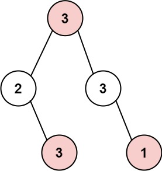
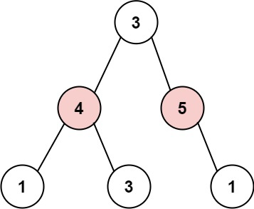

# Guía 12
## Implementación de las diapositivas

En la siguiente carpeta se encuentra la implementación del código suministrado en la clase:

- `/binarytree`, código del binarytree como del binarynode

En la siguiente carpeta se encuentran los test del código suministrado en la clase:

- `/tests`

## Ejercicios

En la carpeta `/ejercicios` encontrarás una implementacion de un binarytree para enteros que deberas usar para resolver los ejercicios

### Ejercicio 1
Escribir un método recursivo que calcule (y devuelva) la suma de todos los nodos en un árbol binario de enteros. El método debe devolver 0 si el árbol está vacío

Por ejemplo: 2 + 7 + 5 + 2 + 6 + 9 + 5 + 11 + 4 =  51

### Ejercicio 2
Escribir un método recursivo que calcule (y devuelva) la suma de los nodos hojas en un árbol binario de enteros. El método debe devolver 0 si el árbol está vacío

Por ejemplo: 2 + 5 + 11 + 4 =  22

### Ejercicio 3
Escribir un método recursivo que calcule (y devuelva) la suma de los nodos internos en un árbol binario de enteros. El método debe devolver 0 si el árbol está vacío o solo tiene raiz o raiz y hojas

Por ejemplo: 7 + 5 + 6 + 9 =  27

### Ejercicio 4
Escribir un método recursivo que calcule (y devuelva) la suma de todos los valores pares de los nodos en un árbol binario de enteros. El método debe devolver 0 si el árbol está vacío

Por ejemplo: 2 + 2 + 6 + 4 =  14

### Ejercicio 5
Escribir un método recursivo que calcule (y devuelva) la cantidad de nodos cuyo valor es mayor o igual que 6 de un árbol binario de enteros. El método debe devolver 0 si el árbol está vacío

Por ejemplo: 7 + 6 + 9 + 11 =  33

### Ejercicio 6
Escribir un método recursivo que calcule (y devuelva) la mayor altura entre el sub-árbol izquierdo y derecho de un árbol binario de enteros. El método debe devolver -1 si el árbol está vacío

Por ejemplo: debe devolver 3

### Ejercicio 7
Escribir un método recursivo que calcule (y devuelva),la suma de todas las hojas de un árbol binario de enteros que son hijas izquierdas de un nodo. El método debe devolver 0 si el árbol está vacío

Por ejemplo: 17 + 27 = 44

### Ejercicio 8

Escribir un método recursivo para un árbol binario de enteros, que calcule (y devuelva) la suma de todos los nodos derechos cuyo valor es impar. El método debe devolver 0 si el árbol está vacío

Por ejemplo: 29 + 15 + 11 = 55

### Ejercicio 9

Agregar a la clase árbol binario dada en clase un método que permita recorrer el árbol por niveles. Pista usar una cola para registrar los hijos de un nodo que se está procesando y que se visitarán luego de terminar de visitar todos los nodos del nivel actual. Por ejemplo dado el árbol de la figura el recorrido por niveles debería mostrar en pantalla: A, B, C, D, E, F, G,H, I, J, K, L.

### Ejercicio 10: El ladrón de casas (bonus)

> Este ejercicio es a modo de desafío, no es necesario que lo hagas si no quieres. Es una variante del problema de la casa del ladrón de casas que vimos en la clase de programación dinámica.

El ladrón ha encontrado un nuevo lugar para sus robos una vez más. Solo hay una entrada a esta área, llamada raíz.

Salvo por la raíz, cada casa tiene una y solo una casa padre. Después de un recorrido, el inteligente ladrón se dio cuenta de que todas las casas en este lugar forman un árbol binario. Se contactará automáticamente con la policía si se roban dos casas directamente conectadas durante la misma noche.

Dado la raíz del árbol binario, devolver la cantidad máxima de dinero que el ladrón puede robar sin alertar a la policía.

#### Ejemplo 1

- **Salida:** 7
- **Explicación:** La cantidad máxima de dinero que el ladrón puede robar = 3 + 3 + 1 = 7.

#### Ejemplo 2

- **Salida:** 9
- **Explicación:** La cantidad máxima de dinero que el ladrón puede robar = 4 + 5 = 9.
